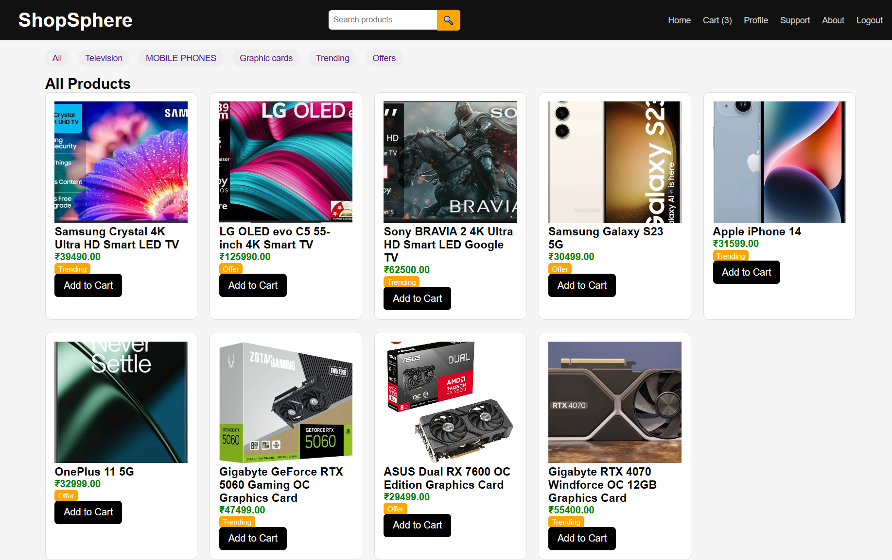
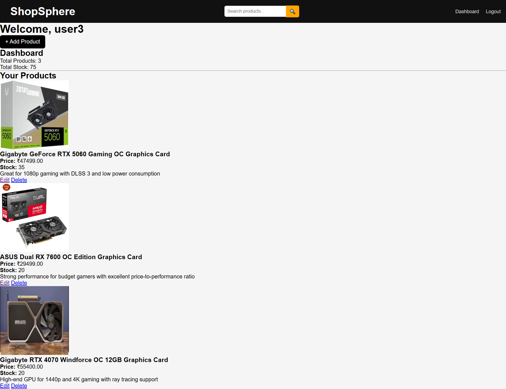
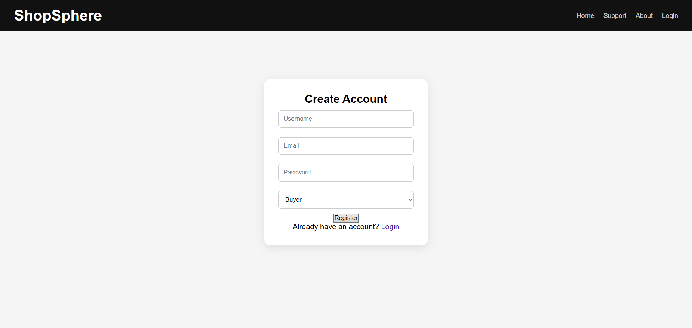
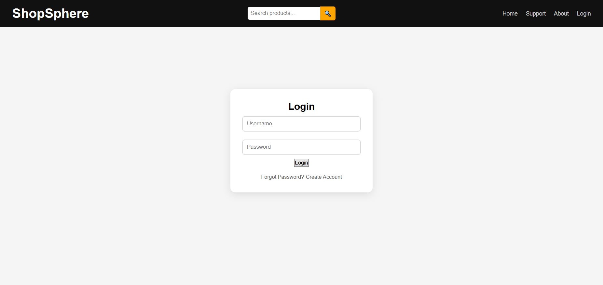
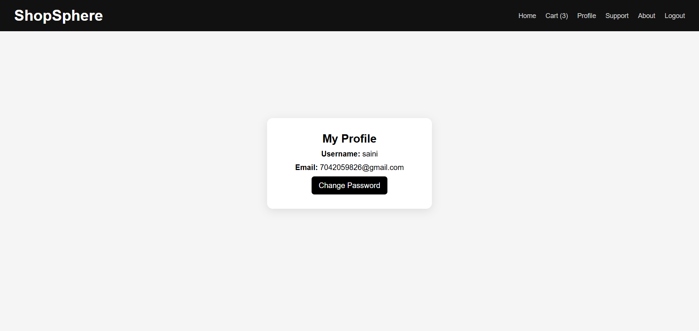
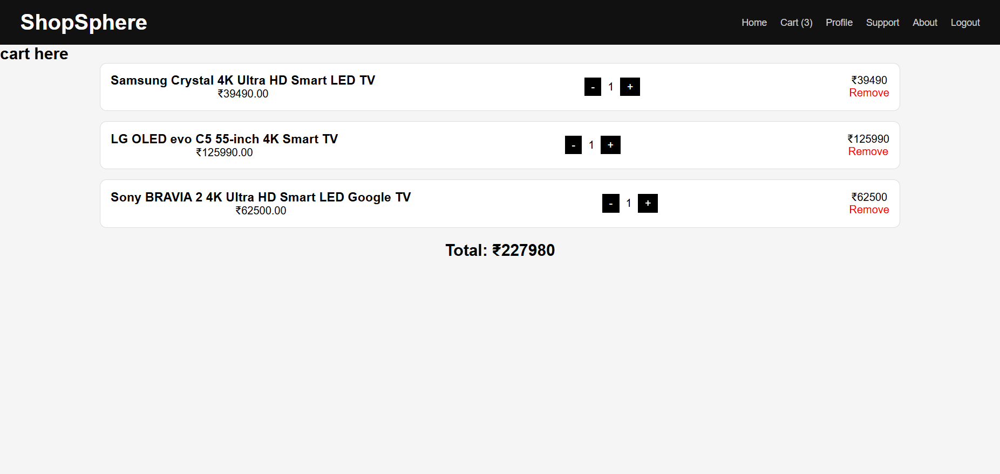

#  Multivendor E-commerce Platform

A full-stack **Multivendor E-commerce Platform** built using Django and Python where multiple vendors can register and manage products through a centralized system.

---

#  Features

-  User Authentication (Login/Register)
-  Vendor Registration & Dashboard
-  Product Management (Add / Update / Delete)
-  Category-Based Filtering
-  Scalable Backend Architecture

---

# Tech Stack

- **Backend:** Python, Django  
- **Database:** SQLite  
- **Frontend:** HTML, CSS, Bootstrap  

---

# Screenshots

<h3 align="center">Homepage</h3>
<p align="center">
  
</p>

<h3 align="center">Vendor Dashboard</h3>
<p align="center">
  
</p>

<h3 align="center">Registration Page</h3>
<p align="center">
  
</p>

<h3 align="center">Authentication Page</h3>
<p align="center">
  
</p>

<h3 align="center">Profile Page</h3>
<p align="center">
  
</p>

<h3 align="center">Cart Page</h3>
<p align="center">
  
</p>


---
# Future Enhancement
#Ordering System
#Payment Methods

# Installation & Setup

Follow these steps to run the project locally:

```bash
# Clone the repository
git clone https://github.com/your-username/multivendor-ecommerce-django.git

# Navigate to project folder
cd multivendor-ecommerce-django

# Create virtual environment
python -m venv venv

# Activate virtual environment
# Windows:
venv\Scripts\activate

# Install dependencies
pip install -r requirements.txt

# Run migrations
python manage.py migrate

# Start server
python manage.py runserver